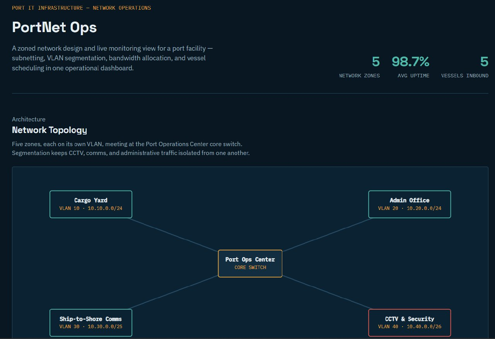
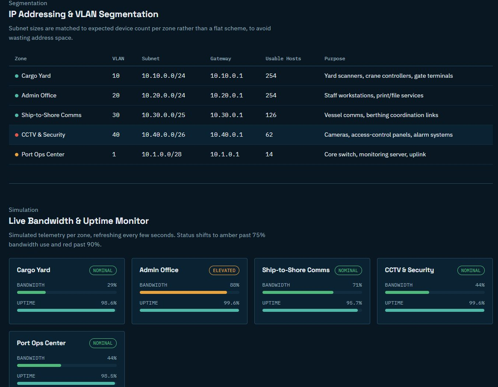
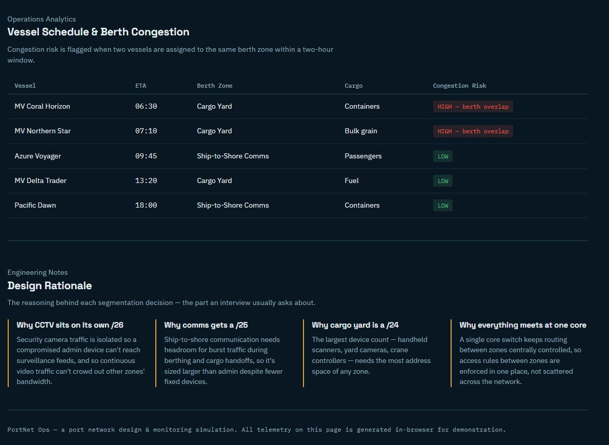

# PortNet Ops

A single-page **port network design and monitoring simulation** that demonstrates practical networking fundamentals alongside a small operations-analytics layer.

## Dashboard screenshots

### PortNet Ops — Overview

### Network Monitoring & Segmentation

### Vessel Operations & Analytics

## What it demonstrates

- **Network topology** — five operational zones connected through a central Port Operations Center.
- **VLAN segmentation** — separate VLANs for cargo, administration, ship-to-shore communications, CCTV/security, and the operations center.
- **IP addressing & subnetting** — subnet sizes matched to expected device counts and operational requirements.
- **Monitoring simulation** — browser-generated bandwidth and uptime telemetry with Nominal, Elevated, and Critical thresholds.
- **Vessel scheduling analytics** — berth-overlap detection when vessels assigned to the same zone arrive within a two-hour window.
- **Engineering rationale** — concise explanations for the addressing and segmentation choices.
- **Responsive UI** — designed for desktop and smaller screens, with basic accessibility improvements.

## Network plan

| Zone | VLAN | Subnet | Gateway | Usable hosts |
|---|---:|---|---|---:|
| Cargo Yard | 10 | 10.10.0.0/24 | 10.10.0.1 | 254 |
| Admin Office | 20 | 10.20.0.0/24 | 10.20.0.1 | 254 |
| Ship-to-Shore Comms | 30 | 10.30.0.0/25 | 10.30.0.1 | 126 |
| CCTV & Security | 40 | 10.40.0.0/26 | 10.40.0.1 | 62 |
| Port Ops Center | 1 | 10.1.0.0/28 | 10.1.0.1 | 14 |

## Design rationale

- **CCTV/security:** isolated into its own subnet to reduce unnecessary cross-zone exposure and contain high-volume surveillance traffic.
- **Ship-to-shore communications:** receives additional address headroom for operational growth and burst activity.
- **Cargo yard:** uses the largest subnet because it represents the largest device population in the model.
- **Operations center:** acts as the logical core for future inter-VLAN routing and policy enforcement.

## Technology

- HTML5
- CSS3
- Vanilla JavaScript
- Inline SVG for topology visualization
- No framework, build step, backend, or package installation required

The project is intentionally lightweight and can be served as static files.

## Live demo

Enable GitHub Pages from **Settings → Pages → Deploy from branch → `main` → `/ (root)`**.

The live project is available at:

**https://gunasheela112-lab.github.io/portnet-ops/**

## Run locally

Open `index.html` directly in a modern browser, or serve the repository with any simple static web server.

No installation or package manager is required.

## Scope & limitations

PortNet Ops is a **portfolio/demo simulation**, not a production network-management system.

- Bandwidth and uptime values are generated in the browser.
- Vessel and berth data is static demonstration data.
- VLANs and segmentation are represented visually; the application does not configure switches, routers, ACLs, or firewalls.
- No real SNMP, NetFlow, device telemetry, or vessel-management system is connected.
- The project does not control real port operations.

These limitations are intentional so the project demonstrates the networking and dashboard concepts without implying real infrastructure access.

## Project structure

- `index.html` — dashboard, topology, monitoring simulation, and vessel analytics
- `README.md` — project documentation
- `overview.jpg` — dashboard overview screenshot
- `monitoring.jpg` — network monitoring screenshot
- `operations.jpg` — vessel operations and analytics screenshot
- `LICENSE` — license information

## License

See [LICENSE](LICENSE).
